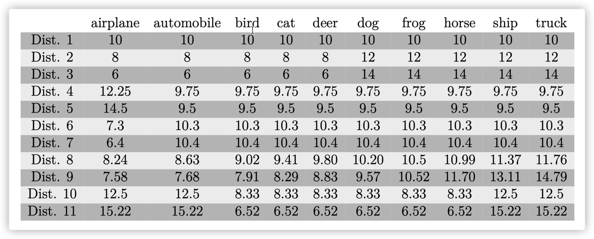
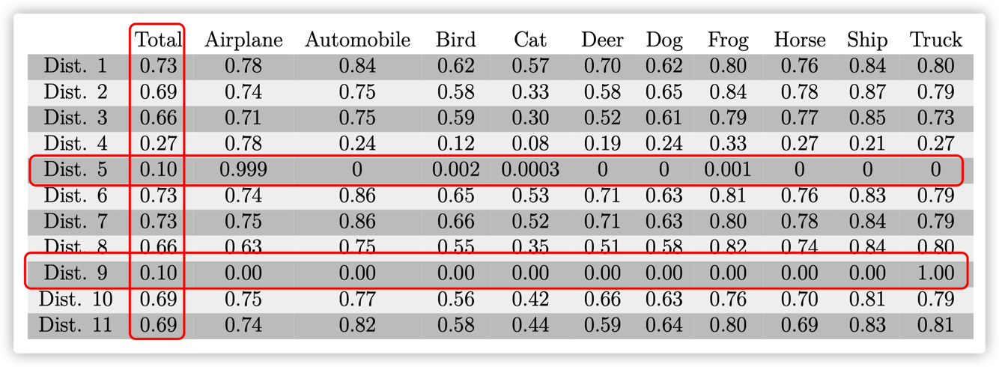

# The Impact of Imbalanced Training Data for Convolutional Neural Networks

## 描述
参加一些算法比赛的时候，发现举办方提供的数据集基本上全都存在样本不均衡的情况，
有的甚至最多的一类和最少的一类数据数据差距在千倍左右。
比如 [2021全国数字生态创新大赛-高分辨率遥感影像分割](https://tianchi.aliyun.com/competition/entrance/531860/introduction) ，
它的数据分布是这样的:


如果不解决数据不均衡的问题，算法模型调的再好都是无用功。

在查找数据不均衡解决方案的时候，我在网上看到这篇文章The Impact of Imbalanced Training Data for Convolutional Neural Networks，里面做了一系列实验讨论训练样本对CNN的影响。
文章很有意思，就跟随大牛的思路试试。

文章是用CIFAR-10来做实验的。CIFAR-10共有10类（airplane，automobile，bird，cat，deer，dog， frog，horse，ship，truck），每一类含有5000张训练图片，1000张测试图片，共60000条数据。

                                          
## 实验设置
第一个实验：


上图中，每一行是一组数据，共十种类别，其中的数字是指每类占总数的比例。

* Dist.1：类别平衡，每一类都占用10%的数据。
* Dist.2、Dist.3：一部分类别的数据比另一部分多。
* Dist.4、Dist.5：只有一类数据比较多。
* Dist.6、Dist.7：只有一类数据比较少。
* Dist.8： 数据个数呈线性分布。
* Dist.9：数据个数呈指数级分布。
* Dist.10、Dist.11：交通工具对应的类别中的样本数都比动物的多。

按照上面的比例，我设置的每个分布每类数据数据量如下，这和文章提到的65%的训练数据量是吻合的。


对每一份训练数据都进行训练，测试时用的测试集还是每类1000个的原始测试集，总量10000，保持不变。

文章的目的并不是追求最佳的结果，只是为了比较数据分布不同对模型的影响。所以模型比较简单，作者给出的结果是这样的：


这里的结果太奇怪了，5、9分布训练的模型完全没有任何分辨能力。我对此持怀疑态度，尤其是9的分布和8差别其实并没有很大，二者的表现却是天壤之别。

这里我自己做了实验，使用的是DLA模型，得到的结果和文章给出的结果偏差极大。


在我的实验中，数据分布差异对模型结果并没有影响，不同分布结果acc都在0.86左右。

## 差异原因分析
和作者实验结果完全不一样，我个人做了以下几条猜测：

* 尽管数据分布有所差异，但是数据量够大，在11个不同的分布中最少的一类依然有1971条数据。
* 数据分布差异不够大，在11个不同的分布中差异最大的仅为2.3倍。
* 模型选择的较好，对cifar数据能学习的很好。
* 作者数据错误，或者造假。

对于以上几条原因，分别进行针对性的实验。
### 1、数据量减少10倍。

数据量减小如下：


同样的模型，不改变任何参数，得到结果如下：


平均准确率从0.51-0.58不等，但是和数据分布相关性并不大，并不呈现出数据量越大的类别准确率越高的现象。所以这条原因pass掉了。

### 2、扩大数据差异
对比原数据集，以及缩小10倍后的数据集，可以看到在作者给出的11个不同分布数据对模型的影响并不大。有明显影响的只是训练数据的多少。

现在尝试扩大数据分布差异，增加四种数据分布如下，最大差异分别是10倍和100倍。


同样的条件下，得到的结果如下：


从这里，可以看到即使数据分布相差10倍以上，模型性能也不会出现明显的差距，依然可以得到比较好的结果。

只有当数据分布差异巨大，比如相差100倍，这样才会看出明显的差距。

从以上数据加上上面的其他数据，我们还能看出有些容易区分的目标，即使数据量比较少，分类效果依然不错，比如automobile和trunk。
### 3、选择其他模型
作者给的模型十分简单，现在算法的发展也不会再用这样的模型了。我本不愿意使用这样的模型， 现在实验证明以上的两种猜测都不对，只能试试作者给到的模型。

本模型3个卷积层和1个全连接层，训练10轮，前8轮lr为0.001，后两轮为0.0001。


### 运行
训练
```shell
python main.py
```

## 实验结果


